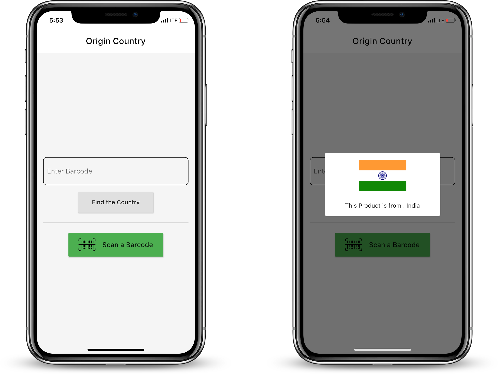

# Origin Country

A Basic Flutter Project for getting fluent with the framework.

Did you know you can find the origin of a product by the prefix on it's barcode ? 

This project is created, to scan a barcode and by the result of the barcode, we will find the origin country of that product.

---

## About The Project

The following plugins have been used : 

- [Fluttertoast](https://pub.dev/packages/fluttertoast)
- [barcode_scan](https://pub.dev/packages/barcode_scan)

 

## Getting Started With Flutter

A few resources to get you started if this is your first Flutter project:

- [Lab: Write your first Flutter app](https://flutter.dev/docs/get-started/codelab)
- [Cookbook: Useful Flutter samples](https://flutter.dev/docs/cookbook)

For help getting started with Flutter, view the
[online documentation](https://flutter.dev/docs), which offers tutorials,
samples, guidance on mobile development, and a full API reference.
